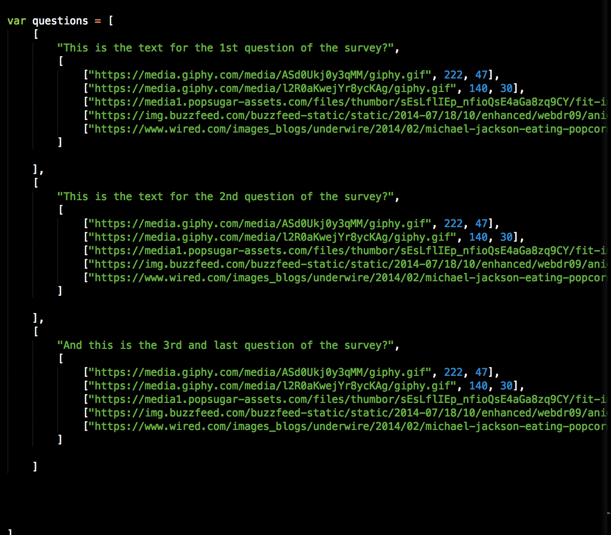

# Funpinion

## How to Add New/Edit Questions



1. Find the "questions" array in the file main.js
2. Each question is encapsulated within [] brackets and separated by comma (except the last question, which doesnt need a comma at the end because it is last). 
	```[
			"This is the text for the 1st question of the survey?",
			[
				["https://media.giphy.com/media/ASd0Ukj0y3qMM/giphy.gif", 222, 47],
				["https://media.giphy.com/media/l2R0aKwejYr8ycKAg/giphy.gif", 140, 30],
			 	["https://media1.popsugar-assets.com/files/thumbor/sEsLflIEp_nfioQsE4aGa8zq9CY/fit-in/1024x1024/filters:format_auto-!!-:strip_icc-!!-/2018/01/03/278/n/1922398/addurlYAmgaN/i/Nope-Rat.gif", 380, 50],
				["https://img.buzzfeed.com/buzzfeed-static/static/2014-07/18/10/enhanced/webdr09/anigif_enhanced-buzz-22799-1405693809-7.gif", 240, 50],
				["https://www.wired.com/images_blogs/underwire/2014/02/michael-jackson-eating-popcorn.gif", 200, 50]
			]

		],
	```
3. The first entry within the [] brackets in double quotes " " is the question and is followed by a comma.
	```[
			"This is the text for the 1st question of the survey?",
			[
				....choices....
			]

		],
	```
4. The gif options are represented in the inner [] brackets of the question + answer combo bracket
	```[
			....question...,
			[
				["https://media.giphy.com/media/ASd0Ukj0y3qMM/giphy.gif", 222, 47],
				["https://media.giphy.com/media/l2R0aKwejYr8ycKAg/giphy.gif", 140, 30],
			 	["https://media1.popsugar-assets.com/files/thumbor/sEsLflIEp_nfioQsE4aGa8zq9CY/fit-in/1024x1024/filters:format_auto-!!-:strip_icc-!!-/2018/01/03/278/n/1922398/addurlYAmgaN/i/Nope-Rat.gif", 380, 50],
				["https://img.buzzfeed.com/buzzfeed-static/static/2014-07/18/10/enhanced/webdr09/anigif_enhanced-buzz-22799-1405693809-7.gif", 240, 50],
				["https://www.wired.com/images_blogs/underwire/2014/02/michael-jackson-eating-popcorn.gif", 200, 50]
			]

		],
	```
5. Each gif option is contained in its own array which contains data about the image url and positioning style separated by comma within the brackets. Each gif option is separated by comma besides the last.
		1. Image URL in the first "" double quotes
		2. Mobile CSS positioning for image (in percentage)
		3. Desktop CSS positioning for image (in percentage)
	```
				["https://media.giphy.com/media/ASd0Ukj0y3qMM/giphy.gif", 222, 47],
				["https://media.giphy.com/media/l2R0aKwejYr8ycKAg/giphy.gif", 140, 30],
			 	["https://media1.popsugar-assets.com/files/thumbor/sEsLflIEp_nfioQsE4aGa8zq9CY/fit-in/1024x1024/filters:format_auto-!!-:strip_icc-!!-/2018/01/03/278/n/1922398/addurlYAmgaN/i/Nope-Rat.gif", 380, 50],
				["https://img.buzzfeed.com/buzzfeed-static/static/2014-07/18/10/enhanced/webdr09/anigif_enhanced-buzz-22799-1405693809-7.gif", 240, 50],
				["https://www.wired.com/images_blogs/underwire/2014/02/michael-jackson-eating-popcorn.gif", 200, 50]
		
	```
